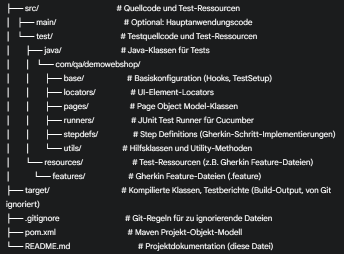

# UI Testautomatisierung - Tricentis Demo Web Shop (Cucumber BDD)

Dieses Projekt demonstriert die automatisierte UI-Testautomatisierung für den **Tricentis Demo Web Shop** (`https://demowebshop.tricentis.com/`) unter Verwendung des **Behavior-Driven Development (BDD)**-Ansatzes mit Cucumber. Es nutzt Java, Maven und eine Best-Practice-Struktur, um robuste, wartbare und skalierbare UI-Tests zu erstellen.

### **1. Projektübersicht**

Das Hauptziel dieses Projekts ist es, wichtige Benutzerinteraktionen und Funktionalitäten des Tricentis Demo Web Shops über die Benutzeroberfläche (UI) hinweg automatisiert zu testen. Durch die BDD-Methodik wird eine gemeinsame Sprache zwischen Business-Stakeholdern, Testern und Entwicklern geschaffen, wodurch Testfälle in einem leicht verständlichen Format (Gherkin-Syntax) beschrieben werden. Dies gewährleistet, dass kritische Workflows für den Endbenutzer wie erwartet funktionieren und regressionsfrei sind.

### **2. Verwendete Technologien**

* **Java:** Die Programmiersprache, in der die Testautomatisierungsskripte geschrieben sind.
* **Maven:** Ein leistungsstarkes Build-Automatisierungstool, das die Abhängigkeitsverwaltung, das Kompilieren und die Testausführung des Projekts steuert.
* **Selenium WebDriver:** Das führende Framework für die Browser-Automatisierung, das die Interaktion mit den Web-Elementen ermöglicht (Klicks, Eingaben, Validierungen).
* **Cucumber:** Ein BDD-Framework, das es ermöglicht, Testfälle in einer menschlich lesbaren Gherkin-Syntax zu schreiben (Given/When/Then) und diese mit Java-Code (Step Definitions) zu verbinden.
* **JUnit 5:** Wird als Test-Runner für Cucumber verwendet, um die BDD-Szenarien auszuführen.
* **WebDriverManager (Bonigarcia):** Vereinfacht die Verwaltung von WebDriver-Executable-Dateien (z.B. Chromedriver), indem diese automatisch heruntergeladen und konfiguriert werden.
* **Page Object Model (POM):** Ein Design-Pattern, das Web-Elemente und deren Interaktionen von der Testlogik trennt. Dies erhöht die Wartbarkeit und Lesbarkeit der Tests.

### **3. Projektstruktur**

Das Projekt folgt einer klaren und bewährten Struktur, die die Best Practices für testautomatisierte Projekte, insbesondere im BDD-Kontext, widerspiegelt:

### **4. Automatisierte Testfälle und Szenarien (BDD-Ansatz)**

Die Tests sind als **Gherkin-Features** in `src/test/resources/features` definiert und durch Java-Step-Definitions in `stepdefs/` implementiert. Dieser BDD-Ansatz ermöglicht es, die Testfälle aus der Perspektive der User Story und des Verhaltens zu beschreiben.

Aktuell fokussiert sich das Projekt auf detaillierte Tests der **Benutzerregistrierung**. Die Hauptszenarien sind:

1.  **Positive Registrierung (`PositiveRegisterSteps.java`):**
    * **Ziel:** Überprüfung des erfolgreichen Erstellens eines neuen Benutzerkontos.
    * **Szenario:** Ein Benutzer navigiert zur Registrierungsseite, füllt das Formular mit **neuen, eindeutigen Benutzerdaten** aus (dynamisch generiert durch `TestUser`), klickt auf den Registrieren-Button. Das System validiert, dass die Registrierung erfolgreich war und der Benutzer anschließend automatisch eingeloggt ist.

2.  **Negative Registrierung (`NegativeRegisterSteps.java`):**
    * **Ziel:** Überprüfung des Systemverhaltens bei wiederholter Registrierung mit derselben E-Mail-Adresse.
    * **Szenario:** Ein Benutzer registriert sich einmal erfolgreich und loggt sich dann aus. Anschließend versucht derselbe Benutzer, sich erneut mit denselben Daten zu registrieren. Das System validiert, dass eine **entsprechende Fehlermeldung** ("The specified email already exists") angezeigt wird.

Diese Szenarien demonstrieren die Fähigkeit des Projekts, sowohl erfolgreiche (positive) als auch unerwartete (negative) Anwendungsflüsse zu testen und die erwarteten Systemreaktionen zu validieren.

Dieses Projekt bietet eine robuste Grundlage für die UI-Testautomatisierung mit dem BDD-Ansatz. Durch die Nutzung von Cucumber und Selenium WebDriver in Verbindung mit Best Practices wie Page Objects und Test Hooks wird eine hohe Testabdeckung und Wartbarkeit erreicht. Die implementierten Testfälle bestätigen das erwartete Verhalten der Registrierungsfunktionalität des Demo Web Shops unter verschiedenen Bedingungen.

---
